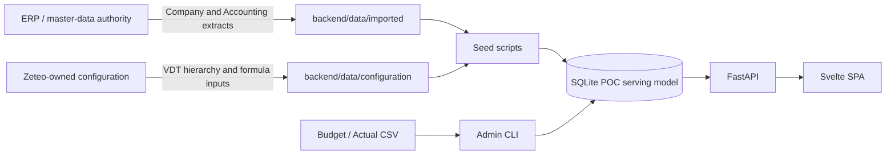
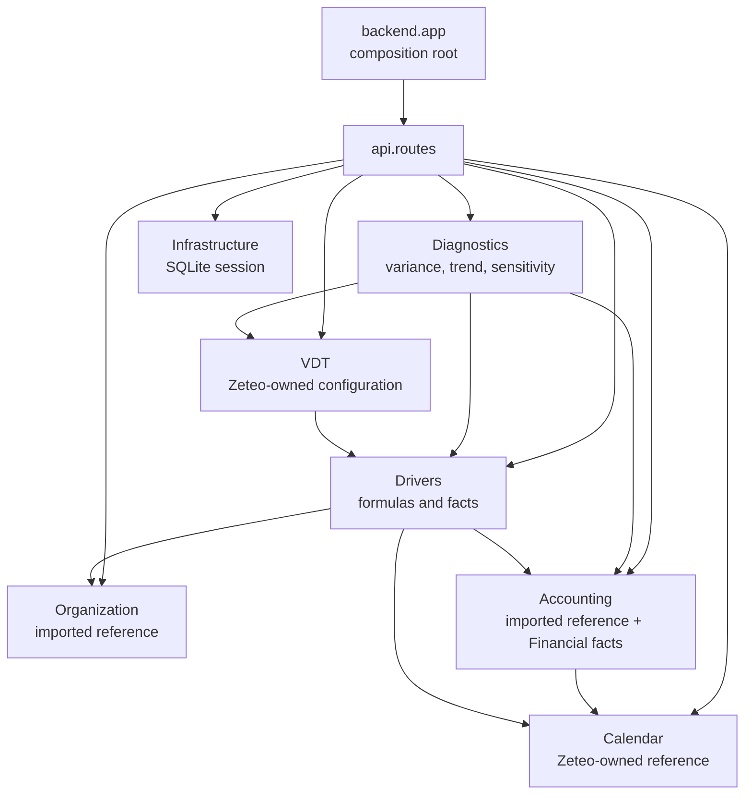
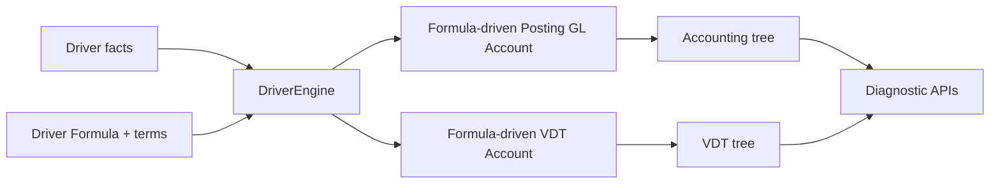

# Zeteo architecture

## Current shape

Zeteo is a Python/FastAPI and Svelte modular monolith. It is one bounded
context, **Zeteo Diagnostic**: the modules share one business language and one
SQLite POC serving model. Module boundaries express ownership and
responsibility; they are not independent deployable services.

`backend/app.py` is the FastAPI composition root. `backend/api/routes.py`
adapts HTTP requests to capability code. The Svelte SPA is a separate frontend
process that calls those APIs.

## Ownership and data flow

Company, Company Hierarchy, Accounting hierarchy, and Posting GL Account are
**ERP-owned diagnostic read models** in Zeteo. Zeteo owns Calendar, VDT,
Drivers, Driver Formulas, and the application setting. The local copies are
optimised for diagnosis and do not write back to the ERP.

The only application-serving database is `backend/data/runtime/zeteo.db`,
which is generated locally and gitignored. It is a **provisional logical Gold
candidate**: an application-facing model, not proof that Bronze, Silver, and
Gold have been physically implemented. The future governed medallion
architecture is outside this POC.

## Capability modules

| Module | Owns | Does not own |
| --- | --- | --- |
| `organization` | Local Company/hierarchy read model and monetary-scope resolution | ERP Company truth or FX conversion |
| `calendar` | Fiscal `year` and fiscal-relative `period` reference | Company fiscal-calendar configuration |
| `accounting` | Imported structure, Financial facts, statement roll-up and comparisons | ERP GL definitions |
| `vdt` | Activity hierarchy and VDT Accounts | Financial posting facts |
| `drivers` | Drivers, facts, Formula/Term configuration, calculation engine | A scenario store |
| `diagnostics` | Variance/trend/sensitivity orchestration | Source master data or persisted decisions |
| `application` | Cross-capability `app_settings` | Feature-specific state |
| `infrastructure` | Database engine and session | Domain rules |
| `api` | HTTP request/response adaptation | Business ownership or calculations |
| `scripts` | Seed and operator entry points | Runtime serving |

## Computation flow

Financial facts are stored at Posting GL Account × Company × fiscal year ×
period × source. Accounting rolls them up through the Accounting hierarchy,
applying normal-balance presentation rules. Driver Facts are stored at Driver
× Company × fiscal year × period × source. `DriverEngine` evaluates ordered,
sum-of-products Formula Terms for a Driver, Posting GL Account, or VDT Account;
it detects cycles and rounds money at the target boundary.

## Time and scope contracts

- Period identity is explicit integer `year` plus `period` (1–12). `period` is
  fiscal-relative; seed data is calendar-aligned today.
- A year, quarter, or month selects a whole fiscal year, three periods, or one
  period. YTD selects fiscal-year start through the chosen month or quarter.
- VDT Trailing mode resolves up to twelve `(year, period)` pairs ending at the
  selected month. It can be shorter when seeded history starts later.
- Monetary APIs accept a Company scope only. They return the Company currency
  and reject non-company scopes rather than silently adding currencies.

## Repository map

| Path | Purpose |
| --- | --- |
| `backend/{organization,accounting,calendar,vdt,drivers,diagnostics}` | Capability-owned models and logic |
| `backend/application` | Cross-capability settings |
| `backend/api` | FastAPI routes |
| `backend/infrastructure` | SQLite setup/session |
| `backend/data/imported` | ERP-shaped POC reference extracts |
| `backend/data/configuration` | Zeteo-owned configuration |
| `backend/scripts` | Seed/import/admin commands |
| `frontend/src/routes` | Screen coordinators and routes |
| `frontend/src/lib` | Stores, API clients, state, and UI components |

## Keeping this guide current

Update this guide when a module boundary, data flow, runtime component, source
ownership boundary, or API delivery flow changes. Use [ADRs](adr/) for
historical rationale, not as the primary current-architecture guide.
