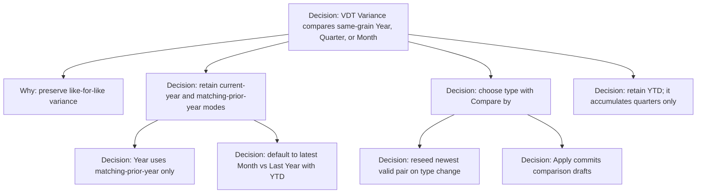

# Decision map

```mermaid
flowchart TD
  vdtVarianceGrain["Decision: VDT Variance compares same-grain Year, Quarter, or Month"] --> vdtVarianceGrainWhy["Why: preserve like-for-like variance"]
  vdtVarianceGrain --> vdtVarianceModes["Decision: retain current-year and matching-prior-year modes"]
  vdtVarianceModes --> vdtVarianceYearMode["Decision: Year uses matching-prior-year only"]
  vdtVarianceGrain --> vdtVarianceSelector["Decision: choose type with Compare by"]
  vdtVarianceSelector --> vdtVarianceReseed["Decision: reseed newest valid pair on type change"]
  vdtVarianceGrain --> vdtVarianceYtd["Decision: retain YTD; it accumulates quarters only"]
  vdtVarianceSelector --> vdtVarianceApply["Decision: Apply commits comparison drafts"]
  vdtVarianceModes --> vdtVarianceDefault["Decision: default to latest Month vs Last Year with YTD"]
```
