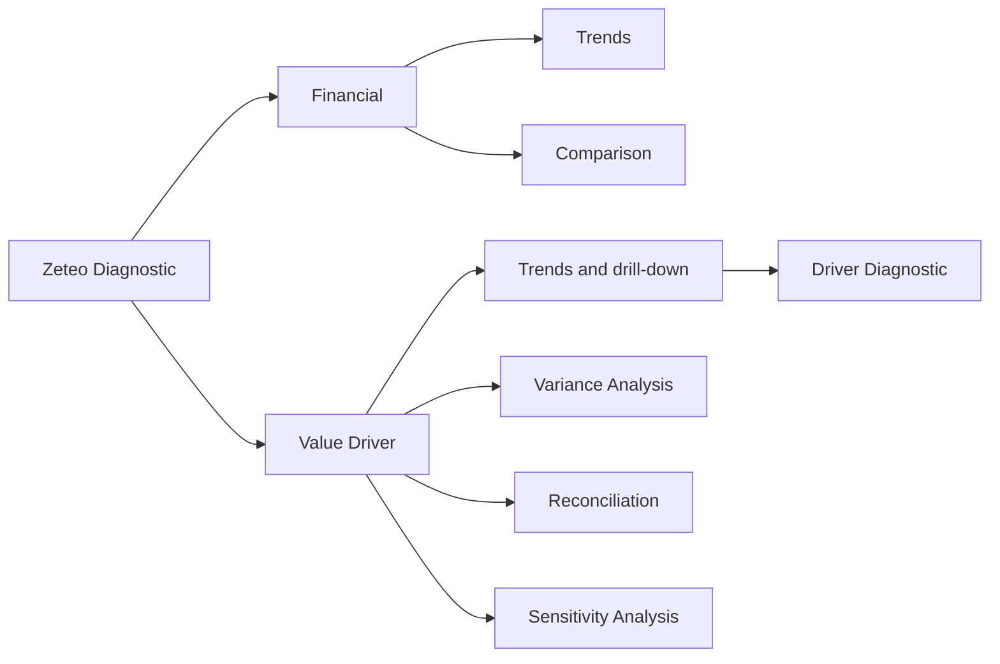

# Zeteo product guide

## What Zeteo is

Zeteo is a financial-performance diagnostic POC. It begins with the Accounting
view of financial movement, then uses the Value Driver Tree (VDT) and Driver
Formulas to expose the operational quantities behind that movement. It is one
Zeteo Diagnostic model, not a collection of separate applications.

For terms such as *VDT Account*, *Driver Formula*, and *diagnostic read
model*, use the [canonical glossary](../CONTEXT.md).

## What is available now

All analytical reports operate on one Company at a time, in that Company's
declared local currency. Group and Business Unit monetary roll-ups are not
supported because FX conversion is not modelled.

| Capability | Business question | Main output | Status |
| --- | --- | --- | --- |
| Financial Trends | How is the Accounting hierarchy performing? | Expandable P&L with Actual, Budget, and Prior Year, plus illustrative KPI/chart views. | Working POC |
| Financial Comparison | What changed between two like-for-like periods? | Bridge and changed Accounting subtree for two Years, Quarters, or Months of the same type. | Working POC |
| VDT Trends | How did the modelled VDT branch move over time? | VDT statement for a fiscal year or trailing window, with Ranked and Tree drill-down. | Working POC |
| VDT Variance Analysis | Which VDT movements explain a period comparison? | Bridge, statement, and an evidence-bound narrative on demand. | Working POC |
| VDT Reconciliation | Where does a VDT estimate differ from Accounting? | VDT amount, linked GL amount, and plain delta at VDT Account leaves. | Working POC |
| VDT Sensitivity Analysis | Which Drivers most affect NPAT structurally? | Streamed elasticity ranking and tornado/table output for a 1–20% bump. | Working POC |
| Driver Diagnostic | What formula and operational values sit beneath an item? | Driver Formula decomposition reached by drill-down. | Working POC |
| Budget and Actual administration | Can POC facts be loaded safely? | Validated, atomic CLI replacement within the documented scope. | Working POC operator workflow |
| Home | What might an executive landing page look like? | Static illustrative KPIs, attention item, and links; it does not read the analytical model. | Demonstration |
| Ask Zeteo / Initiatives | Conversational analysis / initiative workflow. | Routes exist, but both pages say they are not built. | Not yet modelled |

## Important boundaries

- **Accounting and VDT are not the same hierarchy.** Accounting groups Posting
  GL Accounts by GL nature. In the pilot Revenue/Cost of Revenue scope, VDT
  groups independently calculated VDT Accounts by activity.
- A VDT Account's `FA GL` link is a display/reconciliation anchor, not an
  allocation. Several VDT Accounts can point to one Posting GL Account and do
  not have to sum to its amount.
- **Variance Analysis** compares two selected periods. **Trend Analysis**
  scans a fiscal or trailing window for notable month-on-month movement. The
  backend selects material items; the LLM only writes from supplied evidence.
- Sensitivity is structural and in-memory. It does not write a scenario or a
  forecast back to the database.

## POC boundary

The current model is a single SQLite serving layer seeded from checked-in
reference/configuration files and POC facts. It is not a governed data
platform: there is no physical Bronze/Silver/Gold implementation, production
lineage/quality controls, authentication/roles, FX consolidation, or live ERP
integration. The [URS](URS_Zeteo_v2.2.md) is the project/governance reference
for the target programme; it is not a claim about this POC.

The seed process loads ERP-shaped Company/Accounting reference extracts and
Zeteo VDT/Driver configuration. The admin menu can then load validated Budget
or Actual CSV facts. Budget replacement is fiscal year × fact type; Actual
replacement is Company × Current Actual Period × fact type. See the
[README](../README.md#poc-admin-menu) for operator steps and the
[data catalogue](data-catalog.md) for destination tables.
